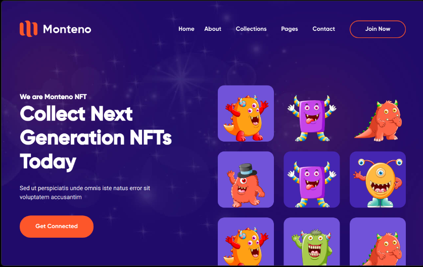

# NFT-Site 🔰

## Table of contents

- [Summary](#summary)
- [Screenshot](#screenshot)
- [Link](#links)
- [Built with](#built-with)
- [Utility Links](#utility-links)

##

> In this project, I have worked with React.js and some great packages to create this good-looking fully-responsive page 🎯.  
> I've used the advantages of React.js to manipulate the DOM efficiently 🎢.  
> I like working with the AOS (Animate on scroll) library, it is magical ✨.  
> I've enjoyed using Swiper.js, that makes us so powerful for building automatic sliders and more 💫.  
> Also working with bootstrap and it's sections (react-bootstrap, react-bootstrap-accordion) and pure-css animations were taken the project to the next level 💥.

## Links

<a href="https://nft-site-coral.vercel.app/">Live Version of the project</a>

## Screenshot

## Built with

- HTML
- CSS
- JavaScript
- React.js

## Utility Links

> [Swiper.js](https://swiperjs.com/)  
> [AOS](https://michalsnik.github.io/aos/)  
> [Bootstrap](https://getbootstrap.com/docs/5.3/getting-started/introduction/)  
> [react-bootstrap-accordion](https://github.com/awran5/react-bootstrap-accordion)  
> [react-tabs](https://github.com/reactjs/react-tabs)

 Keep Building 🚀

